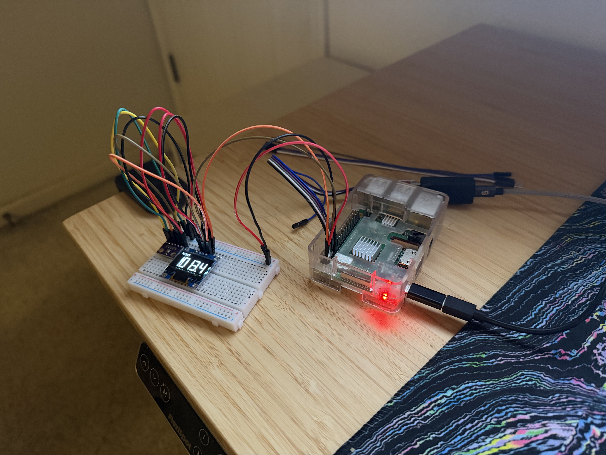
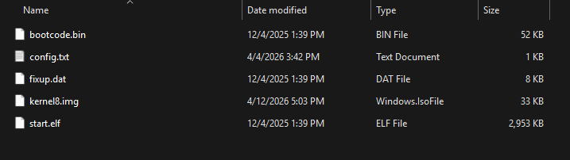
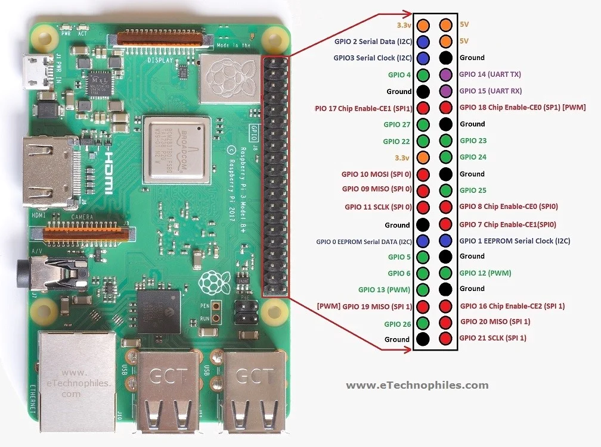
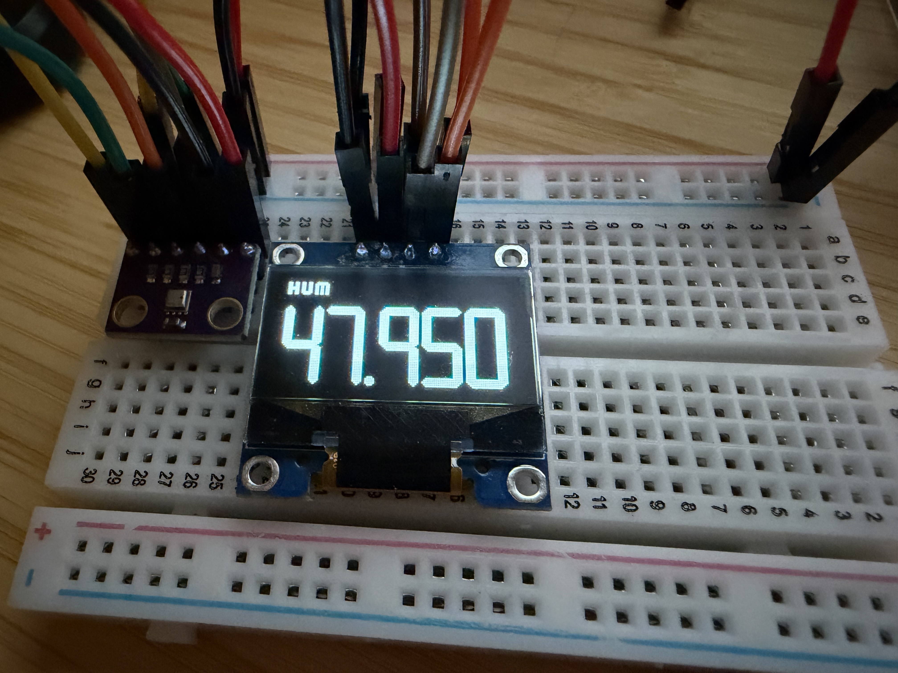
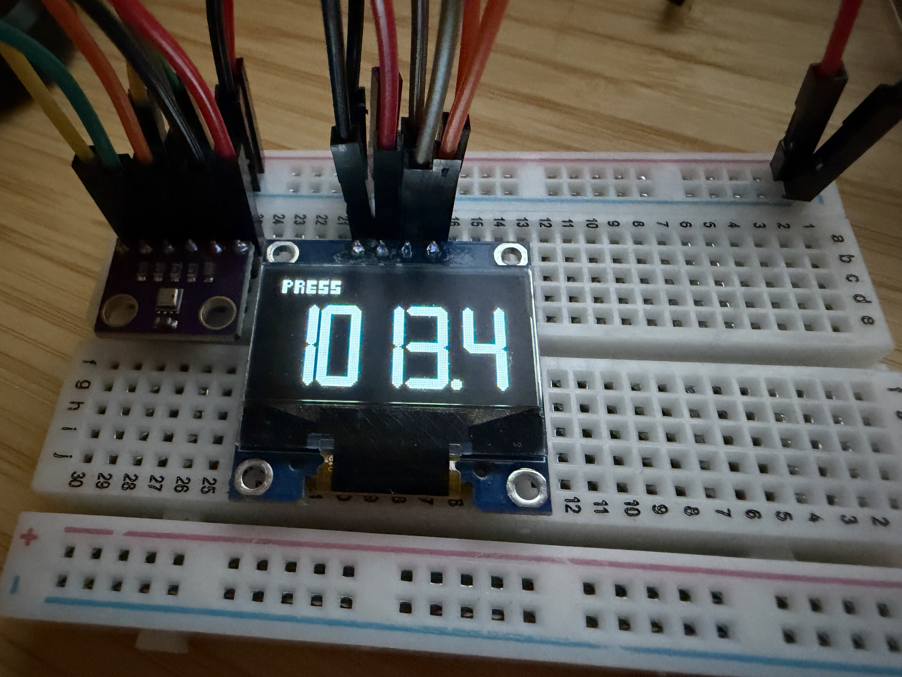
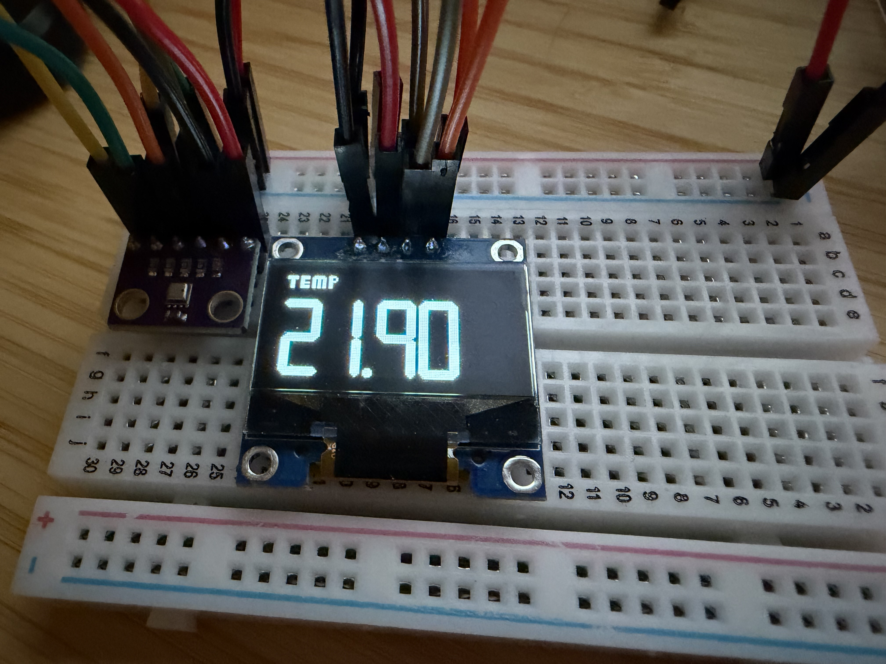

# Humidity, Pressure, and Temperature Display

A scratch RTOS-driven embedded application that measures humidity (RelH),
pressure (hPa), and temperature (C) using a Raspberry Pi 3B+, BME280, and
SSD1306 over I2C.

Using the BCM2835 (RPI 3B+ SoC) peripheral technical manual, SSD1306 datasheet,
and BME280 datasheet I wrote the entire kernel from scratch. This application
runs bare-metal on my Raspberry Pi 3B+ after the GPU bootloader firmware loads
`kernel8.img` into memory and executes it. I also used other resources to learn
and debug the Aarch64 architecture like QEMU, Anthropic's Claude, bztsrc's
[raspi3-tutorial](https://github.com/bztsrc/raspi3-tutorial), and the ARM
architecture documentation.

**Resources:** (for other hobbyists)

- [BCM2835 peripherals technical manual](https://www.raspberrypi.org/app/uploads/2012/02/BCM2835-ARM-Peripherals.pdf) (RPI 3B+ SoC)
    - Section 3 (pp 28-36) for `I2C`
    - Section 6 (pp 89-105) for `GPIO`
    - Section 13 (pp 175-177) for `UART0`
- [BCM2835 GPIOs](https://elinux.org/RPi_BCM2835_GPIOs)
- [SSD1306 datasheet](https://cdn-shop.adafruit.com/datasheets/SSD1306.pdf) (128x64 display)
    - Section 8.1.5 (pp 19-21) for I2C operation
    - Section 10 (pp 34-46) for commands
    - Section 10.1.3 (pp 34-35) for addressing
    - Application Note -> Section 3 (p 5) for software initialization
- [BME280 datasheet](https://www.bosch-sensortec.com/media/boschsensortec/downloads/datasheets/bst-bme280-ds002.pdf)
    - Section 4.2.3 (pp 25-26) for integer compensation functions
    - Section 5 (pp 26-31) for registers
    - Section 6.2 (pp 32-33) for I2C operation
- bztsrc's [raspi3-tutorial](https://github.com/bztsrc/raspi3-tutorial) (bare-metal on RPI 3B+)
- [Cortex A53 technical reference manual](https://documentation-service.arm.com/static/6040c321ee937942ba301626)

## From Repo to Running

Before starting, there are a few pieces of hardware we need:

- Raspberry Pi 3B+
- BME280 sensor + breakout board
- SSD1306 128x64 display + breakout board
- UART to USB dongle (optional, for serial debugging)
- Breadboard
- Jumper wires

All of these can easily be found on amazon for fairly cheap. The most expensive
item is the Raspberry Pi, at $54 when I looked.

### Building `kernel8.img`

First, you need to [download the Aarch64 toolchain](https://developer.arm.com/downloads/-/arm-gnu-toolchain-downloads)
for your platform. I used WSL (linux), so I downloaded `arm-gnu-toolchain-15.2.rel1-x86_64-aarch64-none-elf.tar.xz`.
Make sure you download the `aarch64-none-elf` version so that it generates
ELF files, which are transformed into binary images.

Extract the download's folder, and move it into this repo's root folder
as `toolchain`. Alternatively, it can be placed anywhere and you can modify
the `TOOLPREFIX` environment variable (see Makefile).

Once your toolchain is established, you can run `make` to build `kernel8.img`.

### Creating `bootfs`

- **Using Raspberry Pi Imager**

    1. Format a micro-SD card using Raspberry Pi Imager. I would recommend
       choosing the "Raspberry Pi OS Lite (64-bit)" option.
    2. You should see a new drive called bootfs. Delete all files in here
       except: `bootcode.bin`, `fixup.dat`, and `start.elf`
    3. Copy `config.txt` and `kernel8.img` from here into bootfs

- **From Scratch**

    1. Format a micro-SD card as FAT32
    2. Go to https://github.com/raspberrypi/firmware/tree/master/boot and
       copy `bootcode.bin`, `fixup.dat`, and `start.elf` into the formatted
       SD card
    3. Copy `config.txt` and `kernel8.img` from here into the SD card

Your bootfs should look like this:

### Connecting the wires

Plug your BME280 and SSD1306 into the breadboard. Then, connect the GPIO pins
to the breadboard corresponding input pins for each module:

- Ground to the breadboard ground (then to each module)
- 3.3V to the breadboard positive (then to each module)
- GPIO2 SDA to the BME280 and SSD1306 SDA inputs
- GPIO3 SCL to the BME280 and SSD1306 SCL inputs

My BME280 also came with two extra pins: CSB and SD0.
- CSB is used for SPI, which I am not using and the datasheet said to connect
  to 3.3V in I2C operation
- SD0 changes the address of the I2C module if positive, so connect to ground for
  this

For UART, connect:

- Another GPIO ground to UART dongle ground
- GPIO UART TX to UART dongle RX
- GPIO UART RX to UART dongle TX
- **NOTE**: If the UART dongle comes with power pins (mine did), DO NOT
  connect them to the Raspberry Pi

Here's a good visual reference for Raspberry Pi 3B+ pins:

### Starting the application

Now that everything is connected, you can plug in your micro-SD card
and power cable into the Raspberry Pi and start it. It should immediately start
showing an output on the SSD1306 if you did everything right.

## Examples

**Humidity** (in relative humidity)

**Pressure** (in hPa/mbar)

**Temperature** (in degrees C)

